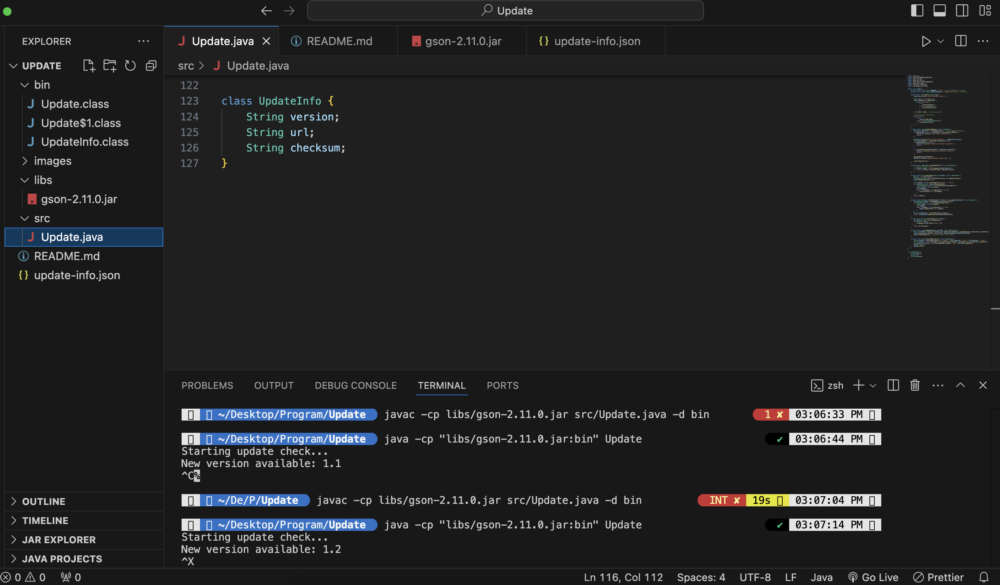

# Self-Updating program

## Overview

This is a self-updating program in Java programming language that periodically checks for updates on a specified server and downloads the latest version if available. Currently, there is a local file with update-info that is used to showcase the working.
The application is designed to work across common operating systems (Windows, Mac, Linux).

## Features

-   Checks for new versions periodically.
-   Downloads and replaces the existing application with the latest version.
-   Easy to set up and use.

## Prerequisites

Before running the application, ensure you have the following:

-   Java Development Kit (JDK) 8 or higher installed.
-   Gson library JAR file (`gson-2.11.0.jar`) stored in the `libs` directory.
-   An internet connection to check for updates.

## Installation

1. **Clone the Repository**:

    ```bash
    git clone https://github.com/anujachivate/self-updating-program.git
    cd self-updating-program
    ```

2. **Compile command**
    ```bash
    javac -cp libs/gson-2.11.0.jar src/Update.java -d bin
    ```
3. **Run/Execute command**
    ```bash
    java -cp "libs/gson-2.11.0.jar:bin" Update
    ```
    
    This screenshot shows the output on the terminal.
